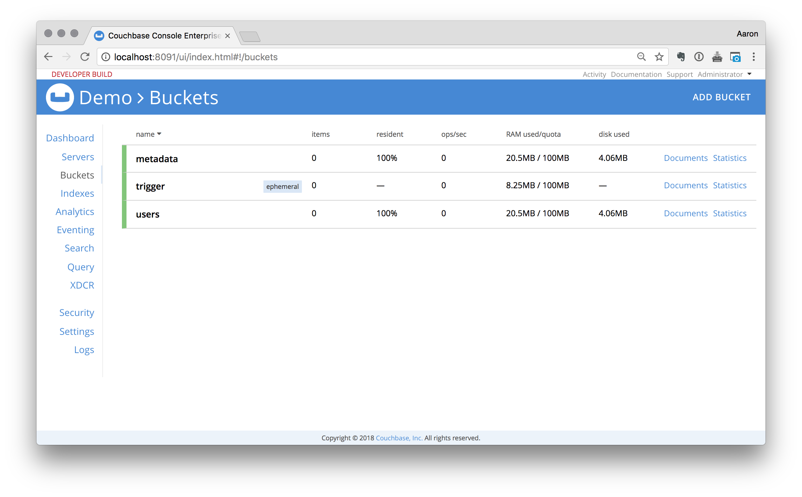

# Eventing Archiving Demo

--

## Description

This demo illustrates how to archive expiring documents from Couchbase Server to an external system.

## Setup

Clone this repository

```bash
git clone https://github.com/bentonam/couchbase-eventing-archive-demo.git
```
`cd` into the project directory

Go ahead and open up the project in your favorite IDE, if you using Atom just run `atom .` from terminal

This demo runs in two Docker containers, one for Couchbase Server and one that serves as an external API, from terminal run the following command:

**Note:** Replace `$URL_TO_BUILD` with a valid rpm build

```bash
docker-compose build \
	--build-arg PACKAGE_URL=$URL_TO_BUILD \
	couchbase
```

This will build and tag the container.  The build reference that I'm using at this time is #1511.

Now start the container

```bash
docker-compose up -d
```

After a few seconds, the Couchbase container will be up and running.  This container has the following services enabled:

- Data
- Index
- Query
- Eventing

You can open the admin console by going to [http://localhost:8091/ui/index.html]() in a web browser.  The default username is `Administrator` and the `password` is password.  You can change these if you'd like in the `docker-compose.yaml` file.  


Browse to the [Buckets](http://localhost:8091/ui/index.html#!/buckets) tag and you will see there is two buckets created for you `flight-data` and `metadata`



## Load Dataset

For this demo, the models are not as important.  We just need documents to work with, execute the following command:

```bash
docker exec eventing-couchbase \
	fakeit couchbase \
	--server localhost \
	--username Administrator \
	--password password \
	--bucket data \
	--seed demo \
	--count 1000 \
	/usr/data/models/users.yaml
```

This will load the `data` bucket with `1,000` user documents documents. 

For reference the documents are modeled as follows: 

```json
{
  "_id": "user::1",
  "_type": "user",
  "user_id": 1,
  "name": "Shyann Gottlieb",
  "email": "Dasia.Pfannerstill@gmail.com",
  "phone": "(920) 364-4805",
  "job_title": "District Interactions Assistant"
}
```

## Eventing Function

Now we need to define an eventing function.  That will fire when documents expire, we will create the expiry documents in the next section. 

From the Admin Console, click on "Eventing"

Click "Add" and fill out the following and then click "Continue"

```
Source bucket: flight-data
Metadata bucket: metadata
Name: func_archive
Description:
	This uses the OnDelete handler to archive expired documents
RBAC username: Administrator
RBAC password: password
```

Click "Continue"

This will deploy a shell of our function that looks similar to:


Paste the following code into the editor:

#### Function

```javascript
function OnUpdate(doc, meta) {
}
function OnDelete(meta) {
    try {
        if (meta.id.indexOf('::trigger') !== -1) {
            var id = meta.id.replace(/::trigger$/, '')
            var query = SELECT d.* FROM `data` AS d USE KEYS [ :id ];
            var doc = query.execQuery()[0];
            // call the external api if there's a document
            if (doc) {
                var http = SELECT CURL(
                    "http://eventing-nodejs:8080/archive/" || :id,
                    {
                        "request":"POST", 
                        "header": "Content-Type: application/json",
                        "data": :doc
                    });
                http.execQuery();
                // delete it from the src bucket
                var del = DELETE FROM `data` USE KEYS [ :id ];
                del.execQuery();
            }
        }
    } catch (err) {
        log('Error', err); 
    }
}
```

Next we need to publish our eventing function.

1. Click on "Eventing"
2. Click on your newly defined function `func_archive`
3. Click on "Deploy", leave the defaults
4. Click "Deploy Function"

## Expiry Documents

The following will create 1000 documents with a `null` value that are set to expiry.  

```bash
docker exec eventing-nodejs \
	node \
	/usr/src/app/load.js
```

Each of the `trigger` documents will expiry every 5 seconds.  

If you watch Couchbase Server, douments will begin to disappear from your bucket, additionally if you look at the project directory where you cloned the repo to, you'll see the documents being added to the `/backup` directory. 